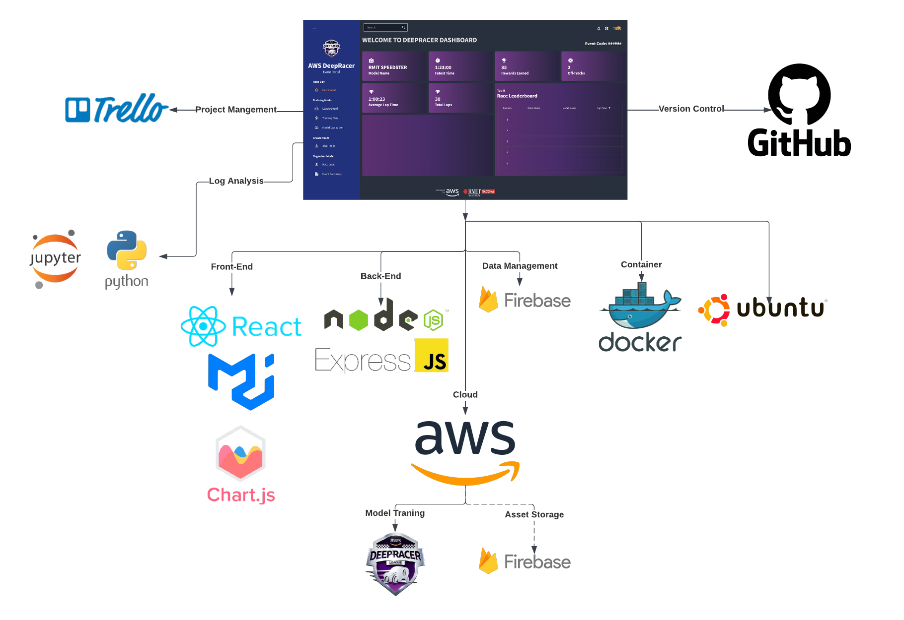

# IP-299-Deepracer

Welcome to our Programming Project repository for Deepracer Dash, a cloud-based dashboard application for Deepracer training and events.

## DEEPRACER DASH

Deepracer Dash provides a comprehensive, high-resolution interface designed to leverage the capabilities of the Global Operations Visualization (GOV) Lab's 40-megapixel tiled display wall at RMIT City Campus. It combines high-resolution views and training diagnostics in a unified interface.

### TECH STACK
- The image below displays the tech stack used throughout the project.

#### FRONT-END

- The front-end of Deepracer Dash is built using the React framework and MaterialUI, providing a sleek and modern user interface.
- 

#### AUTHENTICATION

- The application uses Firebase for user authentication.
- It includes a login and registration system with form validation and error handling.
- The registration form checks for password strength, ensuring it has at least 8 characters, contains a number or symbol, and uses at least one uppercase letter.
- The login form provides a generic error message for invalid email or password to prevent user enumeration.
- The application state is updated based on the authentication state, and the user is redirected to the dashboard upon successful login or registration.

#### BACK-END

- The backend is an Express.js app, which is a Node.js based backend framework. The Express.js backend is integrated with a Firestore Database (Firebase), and a Firebase storage bucket.
- The backend server needs an internet connection, as the cloud database needs to be accessed for all the data presented.
##### Firestore
  - The firebase implementation includes a Firestore database, which stores collections of models, teams, users, and collections of model data named by model name.
  - A service account credentials file is included in the backend, which allows the Express server to add and get documents from the database.
  - As long as the service account information is valid for the database and these collections exist, and the database URL in firebase.js is correct, the database should function.
##### Firebase Storage
  - The firebase storage bucket is used to store model log files, track data for the python notebook, and pictures of generated python graphs.
  - This uses the same credential information as the Firestore database, so the service account credentials file must be valid for the connection to work.
##### Express.js Server
  - The Express backend server is accessed by posting and getting data through endpoints from the React frontend webapp.
  - It is run using the terminal command "npx nodemon index.js" from the /src directory.
  - The express server runs checks to see if a user is logged in, serving the correct data to specific users, and handles user permissions updates based on teamname and account role (Organiser, Participant).
  - Errors are logged in the console of the server, not the browser. If errors occur the console should be checked.
  - Run the command "npm install" before starting the server to install all required packages to your environment.
  - The python notebook for running data analysis is run in a python environment by the server when new model data is uploaded (may be out of scope).
#### BACK-END SETUP OVERVIEW
- Express.js
    - Ensure service account credentials are valid, and the database URL in "firebase.js" are correct.
    - Also ensure that "firebase.js" 'requires' the correct credentials file (e.g. "const serviceAccount = require("../deepracer-52ec7-firebase-adminsdk-z1mqa-0560f04062.json")", where it points to your credentials.json).
    - Navigate to "/deepracer-backend/src".
    - Run "npm install".
    - Run "npx nodemon index.js".
    - Note: A config file is included that holds the backend server IP address in the react app. This needs to be updated to your backend servers IP (If hosted locally, this is "http://localhost:3001").
- Firebase (this may or may not be already hosted after handover).
    - Ensure Storage bucket, Authentication, and Firestore services are initialised.
    - Tables should automatically be initialised as they are called in the backend.
    - Note: There are references to firebase in the frontend, and instances where the credentials may need to be updated in the React app.

#### LOGS

- [Details about logging]

#### DEPLOYMENT

- [Details about how the application is integrated and deployed]

### TEAM

Our project team consists of:

- Rishi (Frontend and CI)
- Jay (Graphing)
- Baris (Data Analysis)
- Anakin (Authentication and CD)
- Dom (Backend)
